<h3><code>abel@github ~ $ ./contributions.sh</code></h3>

  

<h3><code>abel@github ~ $ whoami</code></h3>

 

<h3><code>abel@github ~ $ ls projects/</code></h3>

<a href="https://github.com/Abelchrf/aws-secure-baseline"><code>aws-secure-baseline</code></a> ·
<a href="https://github.com/Abelchrf/devsecops-ml-api"><code>devsecops-ml-api</code></a> ·
<a href="https://github.com/Abelchrf/vision-plus"><code>vision-plus</code></a> ·
<a href="https://github.com/Abelchrf/TweetSentiment"><code>TweetSentiment</code></a>

  

<a href="https://www.linkedin.com/in/abel-charef-a27162307"><code>linkedin.com/in/abel-charef</code></a>

